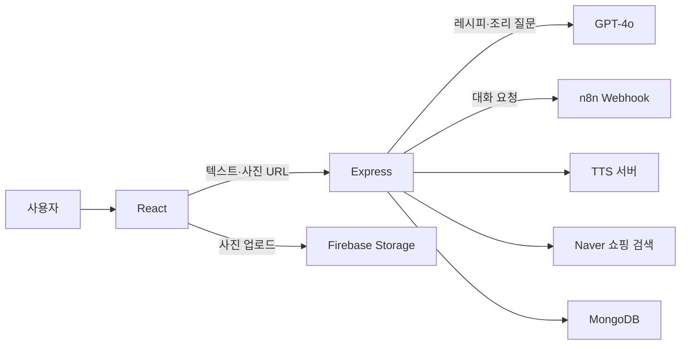

# 장금이 — AI 요리 어시스턴트

**요리를 찾고, 조리 중 질문하고, 필요한 재료를 확인하는 과정을 하나의 웹 화면으로 연결한 졸업작품입니다.**

2025.03–06 · 코돌 · 3인 팀 프로젝트  
React · Express · MongoDB · Firebase · GPT-4o · n8n · TTS

## 해결하려던 문제

레시피를 읽는 것만으로는 조리 중 생기는 질문이나 재료 변경에 대응하기 어렵습니다. 텍스트와 음식 사진으로 레시피를 찾고, 현재 조리 맥락을 담은 질문에 답하도록 구성했습니다.

## 핵심 구현

| 기능 | 구현 근거 |
|---|---|
| 텍스트·이미지 → 레시피 | [server.js](server.js)의 `/upload`: GPT-4o와 JSON Schema로 요리명·재료·조리 단계를 구조화 |
| 조리 중 대화와 화면 동작 | `/assistant` 응답의 action을 [CookingAssistant.js](front/src/components/CookingAssistant.js)가 단계 이동·타이머 등에 연결 |
| 음성 안내 | `/tts`에서 외부 GPT-SoVITS 서버 또는 Google Cloud TTS에 연결 |
| 재료 구매 탐색 | `/api/search`에서 Naver 쇼핑 검색 결과를 받아 구매 화면에 표시 |
| n8n 대화 연동 | `/api/test-command`에서 대화 요청을 외부 n8n Webhook에 전달 |

`test-command`라는 이름이지만 실제 [ChatUI.jsx](front/src/components/ChatUI.jsx)가 호출하므로 정리본에 유지했습니다.

## 구조



n8n 내부 워크플로우는 외부 구성입니다. 이 저장소에는 호출 코드와 [자막 커스텀 노드 소스](integrations/youtube-transcript)가 있으며, 전체 워크플로우를 재현하는 내보내기 파일은 포함하지 않았습니다.

## 시도와 선택

초기에는 LLaMA3-8B 파인튜닝 모델을 활용하려 했습니다. 최종 보고서에는 상용 API 대비 뚜렷한 응답 품질 이점을 얻지 못했고, 응답도 더 느렸다고 기록돼 있습니다. 이에 모델 자체 학습보다 GPT API와 자막·음성·쇼핑 도구를 연결하는 서비스 구현에 집중했습니다.

따라서 파인튜닝은 **검토 후 제외한 접근**으로 기록합니다. 최종 실행 기술 목록에 채택한 모델처럼 넣지 않았습니다. GPT-SoVITS는 외부 음성 서버 연동이며, 학습 가중치와 원본 음성은 포함하지 않았습니다.

## 실행

1. 서버 폴더와 `front`에서 각각 `npm install`을 실행합니다.
2. 각각의 `.env.example`을 `.env`로 복사하고 본인 환경을 설정합니다.
3. 이 폴더에서 `npm start`, 다른 터미널의 `front`에서 `npm start`를 실행합니다.
4. 프론트엔드는 기본 3000, 서버는 기본 5000 포트를 사용합니다.

```sh
# 서버
npm install
npm start

# 별도 터미널
cd front
npm install
npm start
```

레시피 생성에는 OpenAI 설정, 이미지 업로드에는 Firebase 설정, 상품 검색에는 Naver 설정이 필요합니다. n8n과 외부 음성 서버 주소는 본인 환경으로 지정해야 합니다. Google TTS는 애플리케이션 기본 인증 또는 예시 환경변수로 설정합니다.

## 확인 범위와 한계

- 당시 시연과 최종 보고서를 기준으로 기능을 설명했습니다. 현재 외부 서비스까지 연결한 전체 실행 검증은 수행하지 않았습니다.
- 회원가입·로그인·기록 관련 소스는 화면에서 참조돼 남겼으나, 로그인 토큰 발급과 기록 조회의 연결이 완결돼 있지 않습니다. 완성된 인증 기능으로 소개하지 않습니다.
- 음성 생성 지연, 캐릭터별 참고 데이터 부족, 모바일 최적화가 당시 보고서의 개선 과제입니다.
- 정확도·응답 시간 개선율을 수치로 주장할 비교 로그는 확인되지 않아 제시하지 않았습니다.
- 공개 정리 시 서버 시작 오류, 환경변수 설정, 프론트엔드 의존성 등을 손본 범위는 [정리 기록](../../docs/curation.md)을 참고하세요.

## 코드 탐색

`front/src/App.js` → 화면 경로  
`front/src/components/MainApp.js` → 레시피 검색  
`front/src/components/ChatUI.jsx` → n8n 대화  
`front/src/components/CookingAssistant.js` → 조리 보조  
`server.js` → 외부 API 연결
